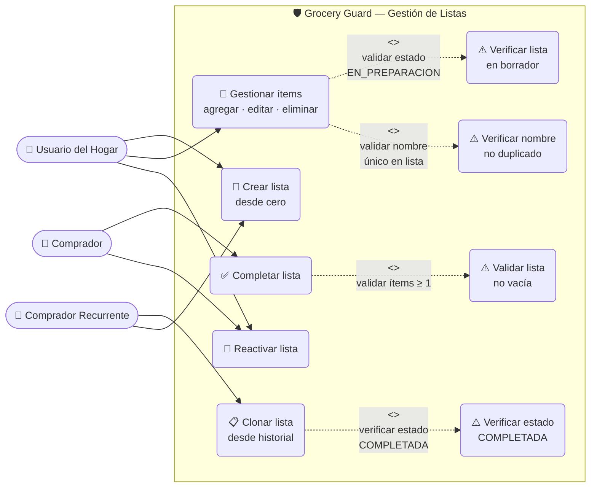
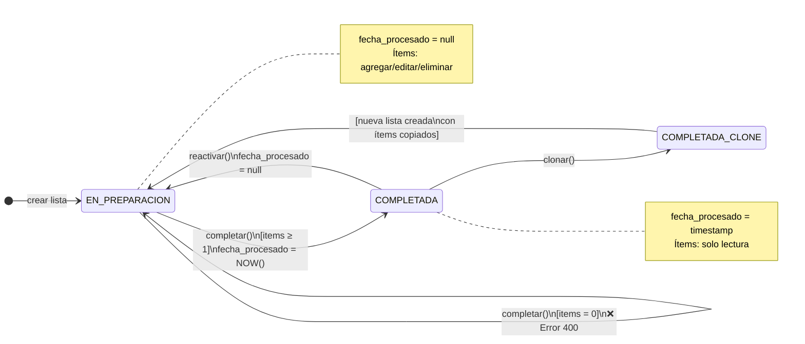
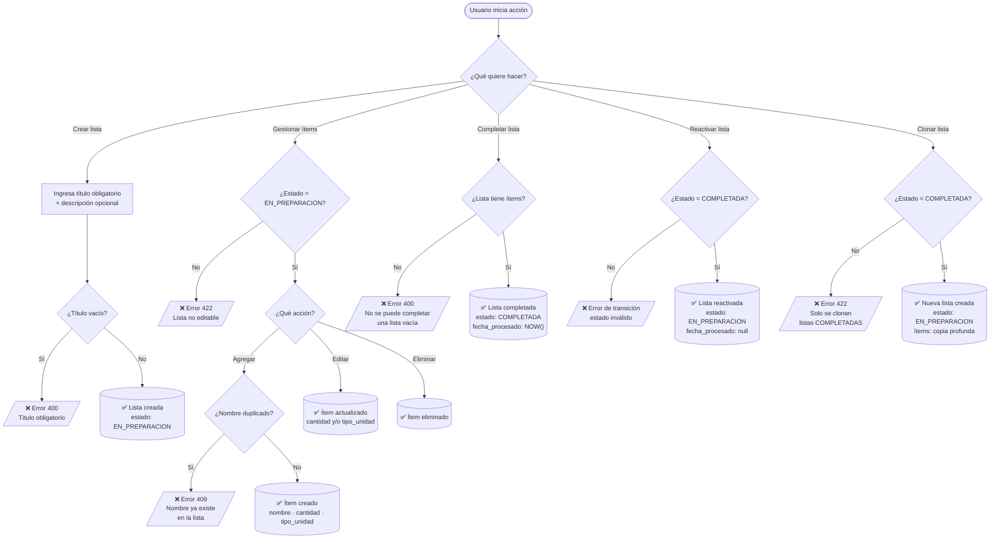
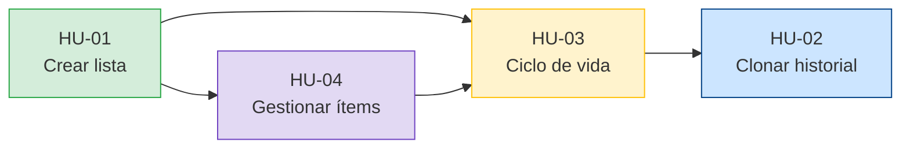

# Overview: Gestión de Listas de Compra

**Feature ID**: 001
**Branch**: `feature/001-shopping-list-lifecycle`
**Versión**: 1.1
**Fecha**: 2026-03-24

---

## Descripción General

**Grocery Guard** resuelve el problema del olvido en el hogar. Esta funcionalidad cubre el ciclo de vida completo de una lista de compras: desde su creación, la gestión de productos (ítems) con nombre, cantidad y unidad, pasando por el control de estados (en preparación / completada), hasta la reutilización de compras anteriores mediante clonación.

El sistema está diseñado para ser usado **en movimiento**, con claridad visual y operaciones rápidas optimizadas para el entorno del supermercado.

---

## Diagrama de Casos de Uso



---

## Diagrama de Estados del Ciclo de Vida



---

## Diagrama de Flujo de Operaciones



---

## Historias de Usuario

| ID | Título | Actor | Documento |
|----|--------|-------|-----------|
| HU-01 | Creación de Lista desde Cero | Usuario del Hogar | [HU-01-crear-lista.md](./stories/HU-01-crear-lista.md) |
| HU-02 | Clonación Basada en Historial | Comprador Recurrente | [HU-02-clonar-historial.md](./stories/HU-02-clonar-historial.md) |
| HU-03 | Gestión del Ciclo de Vida | Comprador | [HU-03-ciclo-de-vida.md](./stories/HU-03-ciclo-de-vida.md) |
| HU-04 | Gestión de Ítems (Productos) | Usuario del Hogar | [HU-04-gestionar-items.md](./stories/HU-04-gestionar-items.md) |

---

## Modelo de Dominio

### Entidad: Lista de Compra

| Campo | Tipo | Oblig. | Descripción |
|-------|------|--------|-------------|
| `id` | UUID | Sí | Generado por el sistema |
| `titulo` | String | Sí | Nombre de la lista |
| `descripcion` | String? | No | Notas adicionales |
| `estado` | Enum | Sí | `EN_PREPARACION` \| `COMPLETADA` |
| `fecha_creacion` | DateTime | Sí | Asignado por el sistema al crear |
| `fecha_procesado` | DateTime? | No | Asignado al completar; `null` al reactivar |
| `items` | List\<Item\> | No | Colección de productos |

### Entidad: Ítem (Producto)

| Campo | Tipo | Oblig. | Descripción |
|-------|------|--------|-------------|
| `id` | UUID | Sí | Generado por el sistema |
| `lista_id` | UUID | Sí | Referencia a la lista contenedora |
| `nombre` | String | Sí | **Único por lista**; inmutable post-creación |
| `cantidad` | Number | Sí | Número positivo > 0 |
| `tipo_unidad` | Enum | Sí | Uno de 12 valores del catálogo |

### Catálogo TipoUnidad

`bolsa` · `caja` · `paquete` · `cartón` · `litro` · `docena` · `libra` · `kilogramo` · `canasta` · `lata` · `botella` · `unidades`

### Enum: Estado de Lista

```
EN_PREPARACION  → Lista activa; ítems editables
COMPLETADA      → Compra finalizada; ítems solo lectura
```

---

## Reglas de Negocio (Resumen)

| ID | Regla | Error si viola |
|----|-------|----------------|
| BR-01 | Título obligatorio al crear | 400 |
| BR-02 | Solo listas `COMPLETADAS` se pueden clonar | 422 |
| BR-03 | No se puede completar lista vacía | 400: "No se puede completar una lista vacía" |
| BR-04 | El sistema asigna todas las fechas | El frontend no envía fechas |
| BR-05 | Clonación no modifica la lista origen | — |
| BR-06 | Reactivar limpia `fecha_procesado` a `null` | — |
| BR-07 | Nombre de producto único por lista | 409: "Ya existe un ítem con ese nombre en la lista" |
| BR-08 | Ítems solo gestionables en `EN_PREPARACION` | 422 |
| BR-09 | `cantidad` debe ser > 0 | 400 |
| BR-10 | `tipo_unidad` debe pertenecer al catálogo | 400 con lista de valores válidos |

---

## Criterios de Éxito

| ID | Criterio | Métrica |
|----|----------|---------|
| SC-01 | Crear lista en < 60 segundos | Tiempo de tarea (usabilidad) |
| SC-02 | Clonar reduce tiempo en ≥ 70% vs. creación manual | Comparación de tiempos |
| SC-03 | Historial 100% intacto tras clonar | 0 modificaciones en lista original |
| SC-04 | Todos los errores de negocio son comprensibles | 100% de errores con mensaje legible |
| SC-05 | Ciclo completo sin errores por usuario nuevo | ≥ 95% tasa de éxito |
| SC-06 | Agregar un producto en < 15 segundos | Tiempo de tarea (usabilidad) |

---

## Dependencias entre Historias



> **Orden de implementación sugerido**: HU-01 → HU-04 → HU-03 → HU-02

---

## Fuera de Alcance (Esta Feature)

- Compartir listas entre múltiples usuarios
- Notificaciones o recordatorios
- Estadísticas de consumo o reportes históricos
- Autenticación y autorización de usuarios
- Marcar ítems como "comprado" dentro del supermercado

---

## Documentos Relacionados

- [Especificación completa (spec.md)](./spec.md)
- [Constitución del Proyecto](../../memory/constitution.md)
- [Checklist de Requisitos](./checklists/requirements.md)
