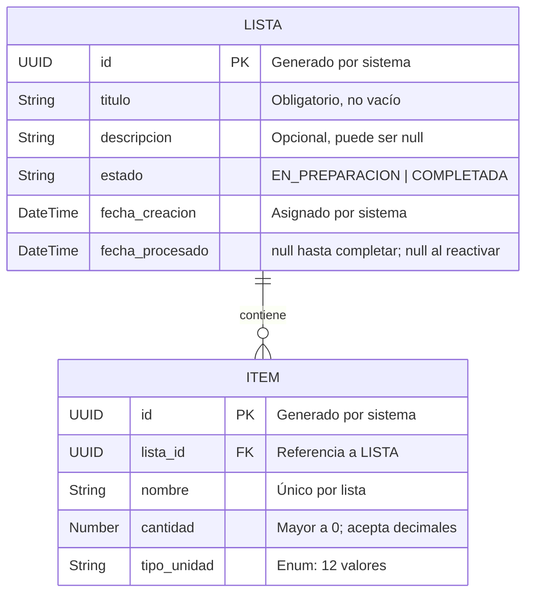

# Data Model

**Feature**: Gestión de Listas de Compra (001)
**Base de Datos**: MongoDB
**Fecha**: 2026-03-24

---

## Diagrama ER (Entidad-Relación)



---

## Colección: `listas`

### Documento MongoDB

```json
{
  "_id": "UUID-string",
  "titulo": "Compras de Marzo",
  "descripcion": "Mercado de la esquina",
  "estado": "EN_PREPARACION",
  "fecha_creacion": "2026-03-24T10:00:00.000Z",
  "fecha_procesado": null
}
```

### Campos

| Campo | Tipo BSON | Obligatorio | Reglas de Validación |
|-------|-----------|-------------|----------------------|
| `_id` | String (UUID) | Sí | UUID v4; generado por sistema |
| `titulo` | String | Sí | No vacío; trim aplicado |
| `descripcion` | String / null | No | Puede ser null |
| `estado` | String (Enum) | Sí | Solo `EN_PREPARACION` o `COMPLETADA` |
| `fecha_creacion` | Date | Sí | Asignado por sistema; no modificable por cliente |
| `fecha_procesado` | Date / null | No | Asignado al completar; null al crear o reactivar |

### Índices

```javascript
// Índice por estado para queries de clonación
db.listas.createIndex({ "estado": 1 })
```

---

## Colección: `items`

### Documento MongoDB

```json
{
  "_id": "UUID-string",
  "lista_id": "UUID-string-de-la-lista",
  "nombre": "Arroz",
  "cantidad": 2.0,
  "tipo_unidad": "kilogramo"
}
```

### Campos

| Campo | Tipo BSON | Obligatorio | Reglas de Validación |
|-------|-----------|-------------|----------------------|
| `_id` | String (UUID) | Sí | UUID v4; generado por sistema |
| `lista_id` | String (UUID) | Sí | Debe referenciar una lista existente |
| `nombre` | String | Sí | No vacío; trim aplicado; único por `lista_id` |
| `cantidad` | Double | Sí | Mayor a 0.0 |
| `tipo_unidad` | String (Enum) | Sí | Debe pertenecer al catálogo de 12 valores |

### Índices

```javascript
// Lookup de ítems por lista (usado en toda operación sobre ítems)
db.items.createIndex({ "lista_id": 1 })

// Unicidad: nombre único por lista (garantiza BR-07 a nivel de DB)
db.items.createIndex(
  { "lista_id": 1, "nombre": 1 },
  { unique: true }
)
```

---

## Enum: EstadoLista

```java
public enum EstadoLista {
    EN_PREPARACION,
    COMPLETADA
}
```

## Enum: TipoUnidad

```java
public enum TipoUnidad {
    BOLSA,
    CAJA,
    PAQUETE,
    CARTON,
    LITRO,
    DOCENA,
    LIBRA,
    KILOGRAMO,
    CANASTA,
    LATA,
    BOTELLA,
    UNIDADES
}
```

---

## Estrategia de Clonación (Deep Copy)

Al clonar una lista, se ejecuta la siguiente secuencia atómica:

```
1. Leer lista origen (validar estado = COMPLETADA)
2. Leer todos los items donde lista_id = origen._id
3. Crear nueva Lista con nuevo _id, fecha_creacion=NOW(), estado=EN_PREPARACION
4. Para cada item origen:
     Crear nuevo Item con nuevo _id, lista_id=nueva_lista._id, mismos nombre/cantidad/tipo_unidad
5. Persistir lista nueva + items nuevos (transacción MongoDB)
6. Retornar lista nueva con sus items
```

> **Nota**: Operación envuelta en transacción MongoDB para garantizar atomicidad. Si falla la copia de cualquier ítem, se hace rollback completo.

---

## Modelo de Dominio Java (Core Layer)

```java
// Domain Model — sin dependencias de Spring ni MongoDB
public record Lista(
    String id,
    String titulo,
    String descripcion,
    EstadoLista estado,
    LocalDateTime fechaCreacion,
    LocalDateTime fechaProcesado,
    List<Item> items
) {
    public boolean estaEnPreparacion() {
        return estado == EstadoLista.EN_PREPARACION;
    }

    public boolean tieneItems() {
        return items != null && !items.isEmpty();
    }
}

public record Item(
    String id,
    String listaId,
    String nombre,
    double cantidad,
    TipoUnidad tipoUnidad
) {}
```
