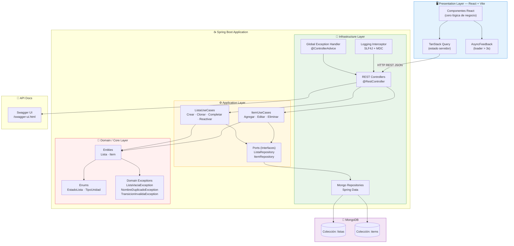
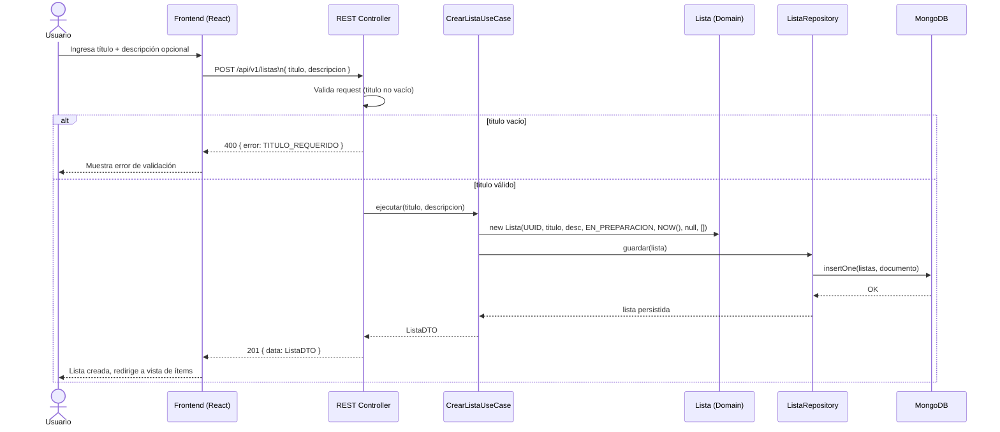
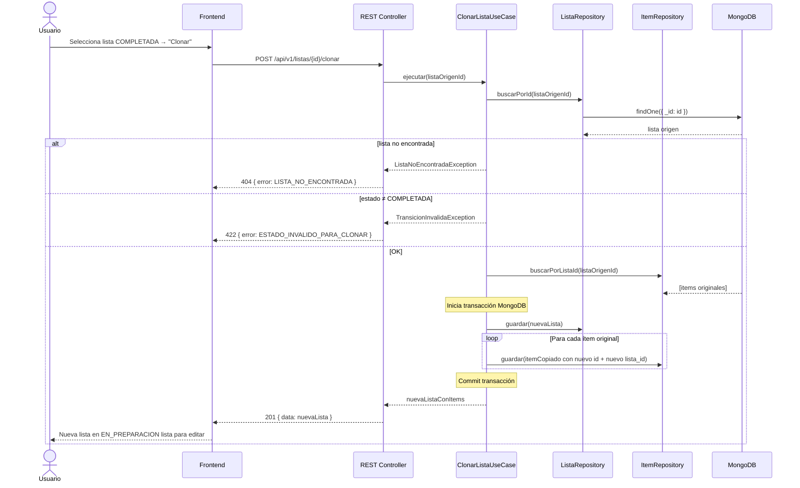
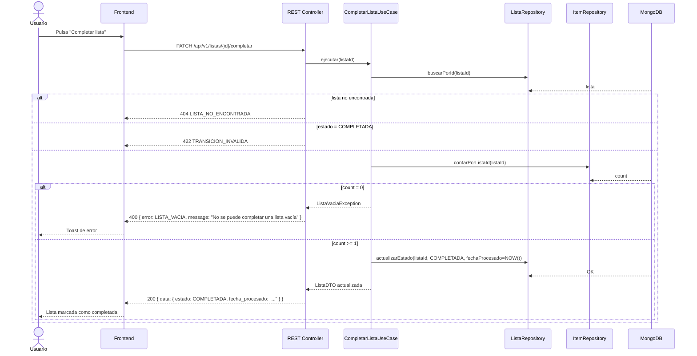
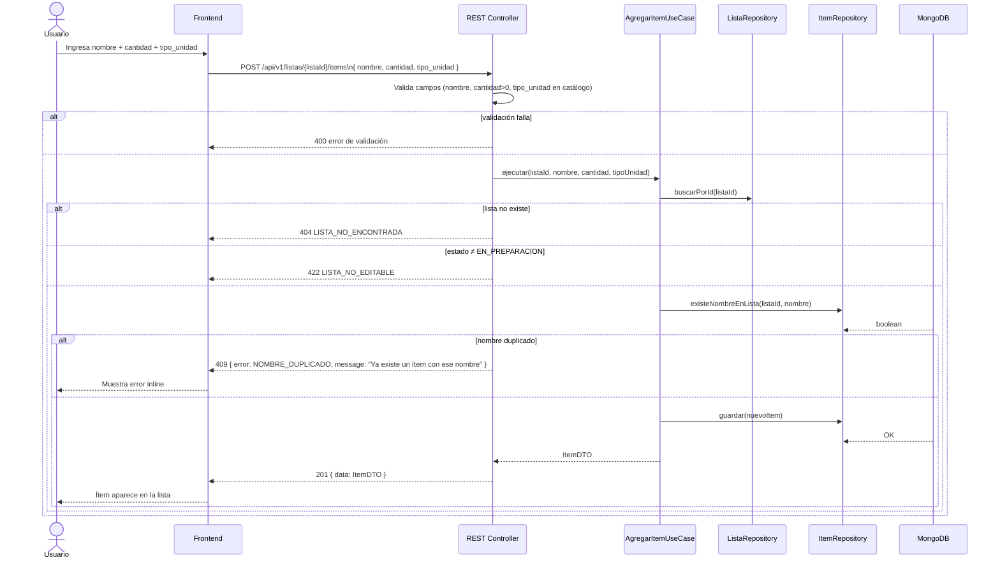
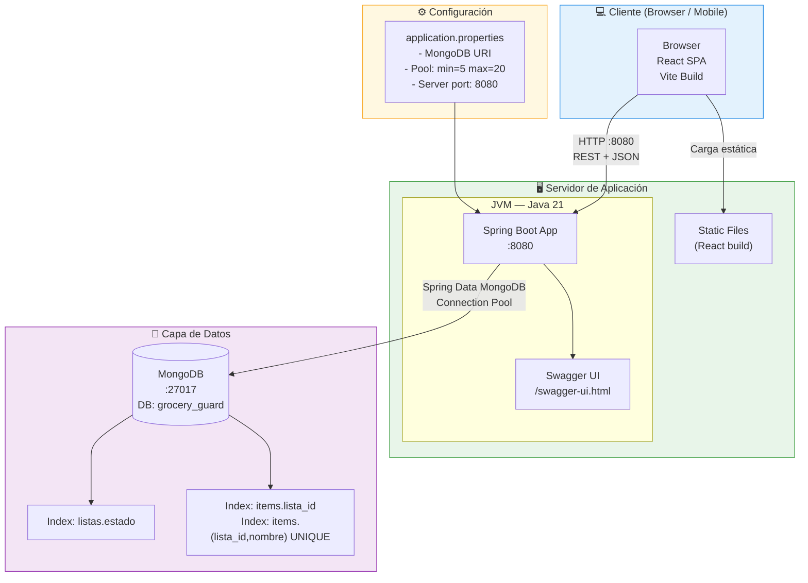
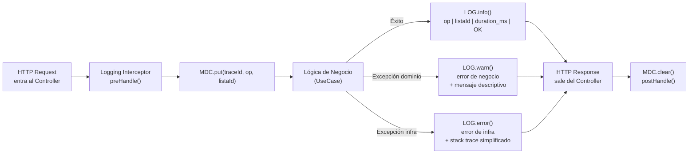

# Documentación Técnica — Grocery Guard v1.0

**Feature**: Gestión de Listas de Compra (001)
**Arquitectura**: Onion Architecture
**Stack**: Java Spring Boot · MongoDB · React + Vite
**Fecha**: 2026-03-24

---

## 1. Diagrama de Componentes



---

## 2. Diagramas de Secuencia

### 2.1 HU-01: Crear Lista



---

### 2.2 HU-02: Clonar Lista



---

### 2.3 HU-03: Completar Lista



---

### 2.4 HU-04: Agregar Ítem



---

## 3. Diagrama de Despliegue



---

## 4. Diagrama de Flujo de la Capa de Logging



### Formato de Log Estructurado

```
[2026-03-24T10:05:32Z] INFO  traceId=abc123 op=CREAR_LISTA listaId=uuid-001 duration_ms=45 result=OK
[2026-03-24T10:05:35Z] WARN  traceId=def456 op=AGREGAR_ITEM listaId=uuid-002 error=NOMBRE_DUPLICADO nombre="Arroz"
[2026-03-24T10:05:40Z] ERROR traceId=ghi789 op=GUARDAR_LISTA error=MongoTimeoutException message="Connection timeout" stackTrace="..."
```

---

## 5. Estructura de Paquetes (Backend)

```
src/main/java/com/groceryguard/
│
├── domain/                          # 💎 CORE — sin dependencias externas
│   ├── model/
│   │   ├── Lista.java               # Record inmutable
│   │   ├── Item.java                # Record inmutable
│   │   ├── EstadoLista.java         # Enum: EN_PREPARACION, COMPLETADA
│   │   └── TipoUnidad.java          # Enum: 12 valores
│   ├── exception/
│   │   ├── ListaVaciaException.java
│   │   ├── NombreDuplicadoException.java
│   │   ├── TransicionInvalidaException.java
│   │   └── ListaNoEncontradaException.java
│   └── port/
│       ├── ListaRepository.java     # Interface (Port)
│       └── ItemRepository.java      # Interface (Port)
│
├── application/                     # ⚙️ CASOS DE USO
│   ├── usecase/
│   │   ├── lista/
│   │   │   ├── CrearListaUseCase.java
│   │   │   ├── ClonarListaUseCase.java
│   │   │   ├── CompletarListaUseCase.java
│   │   │   └── ReactivarListaUseCase.java
│   │   └── item/
│   │       ├── AgregarItemUseCase.java
│   │       ├── EditarItemUseCase.java
│   │       └── EliminarItemUseCase.java
│   └── dto/
│       ├── request/
│       │   ├── CrearListaRequest.java
│       │   ├── AgregarItemRequest.java
│       │   └── EditarItemRequest.java
│       └── response/
│           ├── ListaResponse.java
│           └── ItemResponse.java
│
├── infrastructure/                  # 🔌 ADAPTADORES
│   ├── persistence/
│   │   ├── MongoListaRepository.java   # Implementa domain.port.ListaRepository
│   │   ├── MongoItemRepository.java    # Implementa domain.port.ItemRepository
│   │   └── document/
│   │       ├── ListaDocument.java      # @Document("listas")
│   │       └── ItemDocument.java       # @Document("items")
│   ├── web/
│   │   ├── ListaController.java        # @RestController /api/v1/listas
│   │   ├── ItemController.java         # @RestController /api/v1/listas/{id}/items
│   │   └── GlobalExceptionHandler.java # @ControllerAdvice
│   └── logging/
│       └── RequestLoggingInterceptor.java
│
└── GroceryGuardApplication.java     # @SpringBootApplication
```
