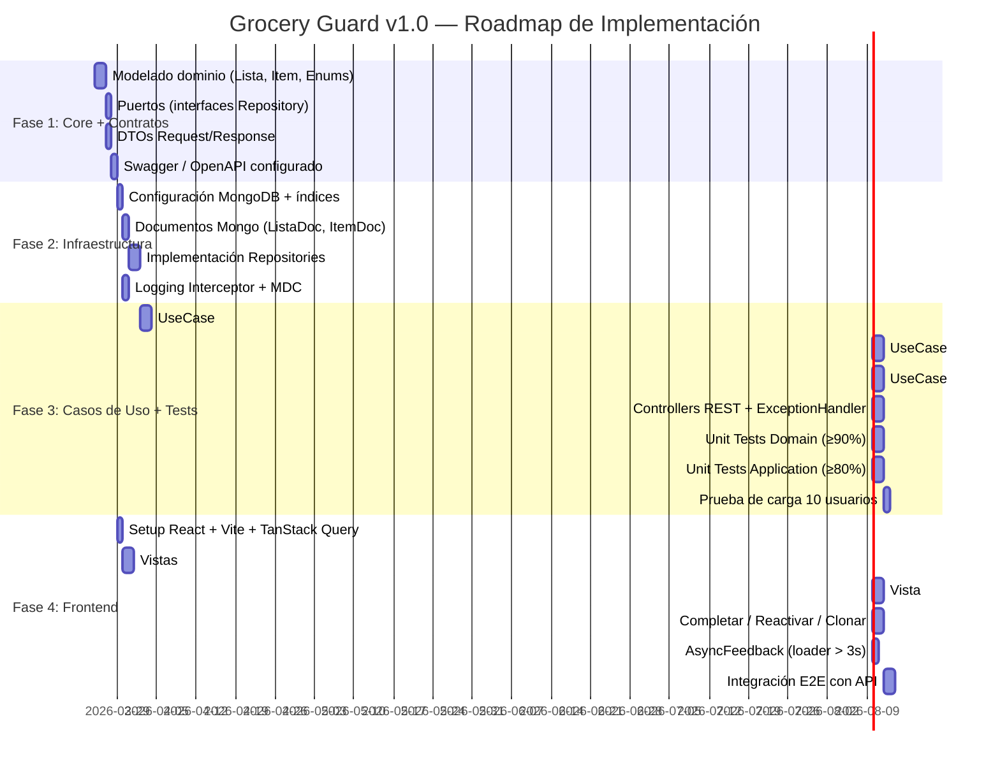

# Implementation Plan — Grocery Guard v1.0

**Feature**: Gestión de Listas de Compra (001)
**Arquitectura**: Onion Architecture
**Stack**: Java 21 · Spring Boot 3.x · MongoDB · React 18 + Vite
**Fecha**: 2026-03-24

---

## Constitution Check ✅

| Mandamiento | Verificación |
|-------------|--------------|
| KISS | Onion con 4 capas bien definidas. Sin frameworks adicionales innecesarios. ✅ |
| Diagnóstico sin Fricción | Logging estructurado con traceId en cada operación. Stack trace simplificado en errores. ✅ |
| Contrato Sagrado | API REST documentada en Swagger. Frontend solo consume; nunca calcula ni valida. ✅ |
| Mantenibilidad sobre Novedad | Spring Boot (estable), MongoDB (maduro), React (estándar industria). ✅ |

**Criterio de onboarding < 30 min**: La estructura de paquetes Onion + Swagger UI permite a un desarrollador nuevo entender el flujo completo sin debugear. ✅

---

## Artefactos del Plan

| Documento | Ruta | Descripción |
|-----------|------|-------------|
| Este documento | `plan/plan.md` | Plan maestro de implementación |
| Investigación técnica | `plan/research.md` | Decisiones y justificaciones |
| Modelo de datos | `plan/data-model.md` | Entidades, campos, índices MongoDB |
| Contratos API | `plan/contracts/api-contracts.md` | Endpoints REST, request/response, errores |
| Arquitectura técnica | `plan/docs/technical-architecture.md` | Diagramas Mermaid: componentes, secuencia, ER, despliegue |

---

## Roadmap de Fases



---

## Fase 1: Núcleo (Core) y Contratos del API

**Objetivo**: El corazón del negocio definido y el contrato de API publicado para que el Frontend empiece a maquetar en paralelo.

**Gate de entrada**: Spec 001 clarificada y aprobada ✅

### Entregables

| Tarea | Capa | Archivo(s) |
|-------|------|------------|
| Modelo `Lista` (record inmutable) | Domain | `domain/model/Lista.java` |
| Modelo `Item` (record inmutable) | Domain | `domain/model/Item.java` |
| Enum `EstadoLista` | Domain | `domain/model/EstadoLista.java` |
| Enum `TipoUnidad` (12 valores) | Domain | `domain/model/TipoUnidad.java` |
| Excepciones de dominio tipadas | Domain | `domain/exception/*.java` |
| Interface `ListaRepository` | Domain (Port) | `domain/port/ListaRepository.java` |
| Interface `ItemRepository` | Domain (Port) | `domain/port/ItemRepository.java` |
| DTOs Request | Application | `application/dto/request/*.java` |
| DTOs Response | Application | `application/dto/response/*.java` |
| SpringDoc OpenAPI configurado | Infrastructure | `pom.xml` + config |

**Gate de salida**: Swagger UI en `/swagger-ui.html` muestra todos los endpoints con request/response correctos.

---

## Fase 2: Infraestructura y Persistencia

**Objetivo**: MongoDB corriendo, repositorios implementados, logging activo.

**Gate de entrada**: Fase 1 completada ✅

### Entregables

| Tarea | Capa | Detalle |
|-------|------|---------|
| `ListaDocument` | Infrastructure | `@Document("listas")` con mapeo de campos |
| `ItemDocument` | Infrastructure | `@Document("items")` con mapeo de campos |
| `MongoListaRepository` | Infrastructure | Implementa `domain.port.ListaRepository` |
| `MongoItemRepository` | Infrastructure | Implementa `domain.port.ItemRepository` |
| Índices MongoDB | DB | `estado` en listas; `lista_id` y `(lista_id, nombre)` único en items |
| `RequestLoggingInterceptor` | Infrastructure | MDC traceId, operación, duración en ms |
| `application.properties` | Config | MongoDB URI, pool min=5 max=20, port=8080 |

**Gate de salida**: Tests de integración con `@DataMongoTest` + Testcontainers pasan. Log aparece en consola con el formato estructurado definido.

---

## Fase 3: Casos de Uso, Controllers y Calidad

**Objetivo**: Toda la lógica de negocio implementada, testeada y expuesta via REST.

**Gate de entrada**: Fase 2 completada ✅

### Casos de Uso a Implementar

| UseCase | HU | Operación principal | Validaciones clave |
|---------|----|--------------------|-------------------|
| `CrearListaUseCase` | HU-01 | `new Lista(...)` + guardar | titulo no vacío |
| `ClonarListaUseCase` | HU-02 | Deep copy + transacción | estado=COMPLETADA; rollback si falla |
| `CompletarListaUseCase` | HU-03 | update estado + fecha_procesado | items.count >= 1 |
| `ReactivarListaUseCase` | HU-03 | update estado + null fecha | estado=COMPLETADA |
| `AgregarItemUseCase` | HU-04 | new Item + guardar | estado=EN_PREPARACION; nombre único |
| `EditarItemUseCase` | HU-04 | update cantidad/tipo_unidad | cantidad > 0; tipo válido |
| `EliminarItemUseCase` | HU-04 | delete por id | estado=EN_PREPARACION; item existe |

### Controllers REST

| Controller | Endpoints |
|------------|-----------|
| `ListaController` | POST /listas · GET /listas · GET /listas/{id} · POST /listas/{id}/clonar · PATCH /listas/{id}/completar · PATCH /listas/{id}/reactivar |
| `ItemController` | POST /listas/{id}/items · PATCH /listas/{id}/items/{itemId} · DELETE /listas/{id}/items/{itemId} |
| `GlobalExceptionHandler` | Mapea excepciones de dominio a HTTP codes + error body estándar |

### Criterios de Calidad

| Métrica | Objetivo | Herramienta |
|---------|----------|-------------|
| Cobertura Domain | ≥ 90% | JUnit 5 |
| Cobertura Application | ≥ 80% | JUnit 5 + Mockito |
| Latencia p100 | < 1000ms | JMeter / k6 |
| Concurrencia | 10 usuarios simultáneos | k6 smoke test |

**Gate de salida**: Todos los endpoints responden con los HTTP codes correctos (validados vs. `api-contracts.md`). Cobertura de tests cumplida. SLA verificado.

---

## Fase 4: Frontend y Experiencia de Usuario

**Objetivo**: UI funcional que consume el API sin lógica de negocio en el cliente.

**Gate de entrada**: Swagger UI disponible (desde Fase 1) · Fase 3 completada para integración ✅

### Vistas Requeridas

| Vista | Ruta | HUs relacionadas |
|-------|------|-----------------|
| Home / Lista de listas | `/` | — |
| Crear nueva lista | `/nueva` | HU-01 |
| Detalle de lista (ítems) | `/lista/:id` | HU-04 |
| Acciones de lista | Modal/inline en detalle | HU-03 |
| Historial (listas COMPLETADAS) | `/historial` | HU-02 |

### Reglas Absolutas del Frontend

1. **Cero validaciones de negocio** en componentes React — toda validación viene del API.
2. **TanStack Query** gestiona caché, loading y error states — no useState manual para datos servidor.
3. **`<AsyncFeedback>`** se activa automáticamente en cualquier mutación/query que supere 3000ms.
4. Errores del API se muestran como **toast/snackbar** con el mensaje del campo `error.message`.

### Estructura de Componentes

```
src/
├── pages/
│   ├── HomePage.jsx
│   ├── NuevaListaPage.jsx
│   ├── DetalleListaPage.jsx
│   └── HistorialPage.jsx
├── components/
│   ├── lista/
│   │   ├── ListaCard.jsx
│   │   ├── ListaForm.jsx
│   │   └── ListaAcciones.jsx      (completar/reactivar/clonar)
│   ├── item/
│   │   ├── ItemList.jsx
│   │   ├── ItemForm.jsx
│   │   └── ItemRow.jsx
│   └── shared/
│       ├── AsyncFeedback.jsx       (loader > 3s)
│       ├── ErrorToast.jsx
│       └── EmptyState.jsx
├── hooks/
│   ├── useListas.js                (TanStack Query: GET /listas)
│   ├── useListaDetalle.js          (TanStack Query: GET /listas/:id)
│   └── useListaMutations.js        (crear, clonar, completar, reactivar)
└── api/
    └── client.js                   (fetch wrapper con base URL y error handling)
```

**Gate de salida**: Flujo completo (crear → agregar ítems → completar → clonar) funciona E2E sin errores. Loader visible en conexiones lentas simuladas.

---

## SLA y Criterios de Aceptación Global

| Criterio | Objetivo | Cómo validar |
|----------|----------|-------------|
| Latencia p100 | < 1000ms | k6 con 10 VUs durante 1 minuto |
| Concurrencia | 10 usuarios sin errores | k6 smoke test |
| Cobertura Backend | Domain ≥90%, Application ≥80% | `mvn test jacoco:report` |
| Errores 4xx/5xx | Todos con mensaje legible | Revisión manual de contratos |
| Onboarding < 30min | Dev nuevo entiende flujo | Revisión de Swagger + README |

---

## Quickstart para Developers

Ver `plan/quickstart.md` para instrucciones de setup local paso a paso.
