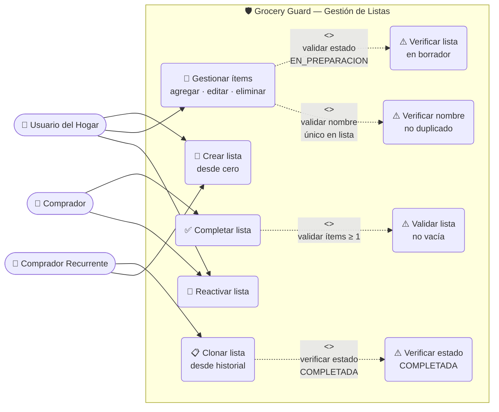

# Feature Specification: Gestión de Listas de Compra

**Feature ID**: 001
**Branch**: `feature/001-shopping-list-lifecycle`
**Status**: Draft
**Created**: 2026-03-24
**Last Updated**: 2026-03-24

---

## Clarifications

### Session 2026-03-24

- Q: ¿Se requieren archivos de historia de usuario independientes por HU para uso como referencia de desarrollo? → A: Sí. Se crean archivos `.md` independientes en `stories/`, uno por HU, con criterios de aceptación, requisitos, reglas de negocio, escenarios de prueba y notas de implementación por historia.
- Q: ¿Se requiere un documento central con diagrama de casos de uso en formato Mermaid? → A: Sí. Se crea `overview.md` con diagramas Mermaid y tabla de navegación. El diagrama de casos de uso también se embebe en `spec.md` para visibilidad directa en PR.
- Q: ¿Los ítems (productos) forman parte del alcance de esta feature? → A: Sí. La gestión de ítems es funcionalidad core: el usuario puede agregar, editar y eliminar productos de una lista mientras esté en estado `EN_PREPARACION`.
- Q: ¿Se pueden editar ítems ya agregados (cantidad y/o unidad), o solo agregar y eliminar? → A: Sí, el usuario puede editar cantidad y/o tipo de unidad de un ítem existente (opción B).
- Q: ¿Puede el mismo nombre de producto aparecer más de una vez en la misma lista? → A: No. El nombre del producto es único por lista; el sistema rechaza duplicados con error descriptivo (opción A).

---

## 1. Vision & Purpose

### Problem Statement
Los usuarios del hogar olvidan ítems en el supermercado o dedican tiempo innecesario recreando listas que ya usaron antes. No existe un mecanismo que les permita gestionar los productos con su cantidad y unidad, reutilizar compras históricas ni seguir el ciclo de vida de una lista desde su preparación hasta su finalización.

### User Value
Optimizar la experiencia de compra mediante la creación ágil de listas, la gestión precisa de productos (nombre, cantidad y unidad), y la reutilización de compras históricas para ahorrar tiempo y reducir olvidos.

### Business Value
- Reducción del tiempo promedio para crear una lista de compra recurrente.
- Fidelización del usuario al retener su historial de consumo con detalle de productos.
- Base de datos de patrones de compra que habilita futuras funcionalidades (sugerencias, estadísticas).

---

## 2. Actors & Stakeholders

| Actor | Rol | Interacción Principal |
|-------|-----|-----------------------|
| Usuario del Hogar | Primario | Crea y gestiona listas y productos desde casa |
| Comprador | Primario | Usa la lista activa en el supermercado |
| Comprador Recurrente | Primario | Clona listas anteriores para nuevas compras |

---

## 3. Diagrama de Casos de Uso



---

## 4. User Stories

> 📂 **Referencia rápida para desarrolladores**: Cada historia tiene su propio archivo detallado en la carpeta `stories/`:
> - [HU-01 — Creación de Lista desde Cero](./stories/HU-01-crear-lista.md)
> - [HU-02 — Clonación Basada en Historial](./stories/HU-02-clonar-historial.md)
> - [HU-03 — Gestión del Ciclo de Vida](./stories/HU-03-ciclo-de-vida.md)
> - [HU-04 — Gestión de Ítems (Productos)](./stories/HU-04-gestionar-items.md)
>
> 🗺️ **Vista global con diagramas Mermaid**: [overview.md](./overview.md)

### HU-01: Creación de Lista desde Cero
**Como** usuario del hogar
**Quiero** crear una nueva lista de compras con nombre y descripción
**Para** organizar los productos que necesito comprar

**Criterios de Aceptación**:
- El sistema solicita: `título` (obligatorio) y `descripción` (opcional).
- La fecha de creación (`fecha_creacion`) se asigna automáticamente por el sistema al momento del registro.
- El estado inicial de toda lista recién creada es `EN_PREPARACION`.
- No es posible crear una lista sin título.

---

### HU-02: Clonación Basada en Historial
**Como** comprador recurrente
**Quiero** seleccionar una lista `COMPLETADA` y clonarla para una nueva compra
**Para** no tener que reescribir los mismos productos cada semana

**Criterios de Aceptación**:
- Solo se pueden clonar listas en estado `COMPLETADA`.
- Al clonar se genera una nueva entidad con un `id` único y una `fecha_creacion` con el timestamp actual.
- Todos los ítems de la lista original se copian a la nueva lista como entidades independientes.
- El estado de la nueva lista clonada es `EN_PREPARACION`.
- La lista original permanece intacta e inmutable; no se modifica ni elimina.
- La descripción de la nueva lista es editable por el usuario antes de confirmar la clonación.

---

### HU-03: Gestión del Ciclo de Vida (Estados)
**Como** usuario en el supermercado
**Quiero** marcar una lista como terminada y poder reabrirla si es necesario
**Para** mantener el historial limpio y poder corregir errores

**Criterios de Aceptación**:

**Completar lista (`EN_PREPARACION` → `COMPLETADA`)**:
- El sistema registra automáticamente `fecha_procesado` con el timestamp del momento de la transición.
- No es posible completar una lista que no tenga al menos un ítem. El sistema rechaza la acción con un mensaje descriptivo.

**Reactivar lista (`COMPLETADA` → `EN_PREPARACION`)**:
- La lista vuelve a estado `EN_PREPARACION` y queda disponible para edición de ítems.
- El campo `fecha_procesado` se limpia (valor `null`) al reactivar, ya que la compra no se considera finalizada.

---

### HU-04: Gestión de Ítems (Productos)
**Como** usuario del hogar
**Quiero** agregar, editar y eliminar productos dentro de una lista en borrador
**Para** construir la lista exacta de lo que necesito comprar con la cantidad y unidad correcta

**Criterios de Aceptación**:
- Solo se pueden gestionar ítems en listas con estado `EN_PREPARACION`.
- Un ítem se compone de: `nombre` (obligatorio), `cantidad` (obligatorio, número positivo) y `tipo_unidad` (obligatorio, valor del catálogo definido).
- No pueden existir dos ítems con el mismo `nombre` en una misma lista. El sistema rechaza duplicados con error descriptivo.
- El usuario puede editar la `cantidad` y/o `tipo_unidad` de un ítem existente sin eliminarlo.
- El usuario puede eliminar un ítem de la lista individualmente.
- Los tipos de unidad aceptados son: `bolsa`, `caja`, `paquete`, `cartón`, `litro`, `docena`, `libra`, `kilogramo`, `canasta`, `lata`, `botella`, `unidades`.

---

## 5. Domain Model

### Entidad: Lista de Compra

| Campo | Tipo | Obligatorio | Descripción |
|-------|------|-------------|-------------|
| `id` | UUID | Sí | Identificador único de la lista. Generado por el sistema. |
| `titulo` | String | Sí | Nombre descriptivo de la lista (ej: "Súper Mensual"). |
| `descripcion` | String | No | Notas adicionales (ej: "Comprar en el mercado de la esquina"). |
| `estado` | Enum | Sí | Estado actual del ciclo de vida: `EN_PREPARACION` o `COMPLETADA`. |
| `fecha_creacion` | DateTime | Sí | Timestamp de creación del registro. Asignado automáticamente por el sistema. |
| `fecha_procesado` | DateTime | No | Timestamp de cuando el estado cambió a `COMPLETADA`. `null` si no ha sido completada o fue reactivada. |
| `items` | List\<Item\> | No | Colección de productos asociados a la lista. Vacía al crear. |

### Entidad: Ítem (Producto)

| Campo | Tipo | Obligatorio | Descripción |
|-------|------|-------------|-------------|
| `id` | UUID | Sí | Identificador único del ítem. Generado por el sistema. |
| `lista_id` | UUID | Sí | Referencia a la lista que contiene este ítem. |
| `nombre` | String | Sí | Nombre del producto (ej: "Arroz"). **Único por lista**. |
| `cantidad` | Number | Sí | Cantidad a comprar. Debe ser un número positivo mayor a 0. |
| `tipo_unidad` | Enum | Sí | Unidad de medida del producto. Ver catálogo abajo. |

### Catálogo: TipoUnidad

| Valor | Ejemplo de uso |
|-------|---------------|
| `bolsa` | Arroz, 2 bolsas |
| `caja` | Cereal, 1 caja |
| `paquete` | Galletas, 3 paquetes |
| `cartón` | Huevos, 1 cartón |
| `litro` | Leche, 2 litros |
| `docena` | Pandebono, 1 docena |
| `libra` | Carne molida, 2 libras |
| `kilogramo` | Papa, 3 kilogramos |
| `canasta` | Fruta, 1 canasta |
| `lata` | Atún, 4 latas |
| `botella` | Aceite, 1 botella |
| `unidades` | Aguacate, 3 unidades |

### Estados del Ciclo de Vida

```
[NUEVA]
   │
   ▼
EN_PREPARACION ──── (completar, requiere ≥1 ítem) ───► COMPLETADA
      ▲   ▲                                                  │
      │   └────── gestión de ítems habilitada ──────────┘   │
      └──────────────── (reactivar) ────────────────────────┘
```

| Estado | Descripción | `fecha_procesado` | Ítems editables |
|--------|-------------|-------------------|-----------------|
| `EN_PREPARACION` | Lista en edición activa (Draft) | `null` | ✅ Sí |
| `COMPLETADA` | Compra realizada con éxito (Archived) | timestamp | ❌ No |

> **Nota de diseño**: El estado "Reactivada" no es un valor del enum. Es el resultado de la transición `COMPLETADA → EN_PREPARACION`. El enum tiene exactamente dos valores.

---

## 6. Functional Requirements

### FR-01: Creación de Lista
- El sistema acepta `titulo` (requerido) y `descripcion` (opcional) como datos de entrada.
- El sistema asigna automáticamente `id` (UUID), `fecha_creacion` (timestamp actual) y `estado = EN_PREPARACION`.
- Si el `titulo` está ausente o vacío, el sistema rechaza la operación con un error de validación descriptivo.

### FR-02: Clonación de Lista
- El sistema acepta el `id` de una lista existente en estado `COMPLETADA`.
- El sistema genera una nueva lista con: nuevo `id`, `fecha_creacion` actual, `estado = EN_PREPARACION`, `fecha_procesado = null`.
- Los ítems se copian como entidades independientes (copia profunda, nuevos IDs) para no afectar la lista original.
- Si la lista origen no existe o no está en estado `COMPLETADA`, el sistema rechaza la operación con un error descriptivo.

### FR-03: Transición a COMPLETADA
- El sistema verifica que la lista tenga al menos un ítem antes de permitir la transición.
- Si la lista está vacía, el sistema responde con error: *"No se puede completar una lista vacía"*.
- Si la validación pasa, el sistema actualiza `estado = COMPLETADA` y `fecha_procesado` al timestamp actual.

### FR-04: Reactivación de Lista
- El sistema acepta el `id` de una lista en estado `COMPLETADA`.
- El sistema actualiza `estado = EN_PREPARACION` y `fecha_procesado = null`.
- Si la lista no está en estado `COMPLETADA`, el sistema rechaza la operación con un mensaje apropiado.

### FR-05: Integridad de Fechas
- Ningún cliente externo puede enviar ni modificar `fecha_creacion` o `fecha_procesado`; estos campos son de solo escritura interna del sistema.

### FR-06: Agregar Ítem a Lista
- Solo se pueden agregar ítems a listas en estado `EN_PREPARACION`.
- El sistema acepta: `nombre` (requerido), `cantidad` (requerido, número > 0) y `tipo_unidad` (requerido, valor del catálogo).
- Si el `nombre` ya existe en la lista, el sistema rechaza la operación con error: *"Ya existe un ítem con ese nombre en la lista"*.
- Si el `tipo_unidad` no pertenece al catálogo definido, el sistema rechaza la operación con error de validación.
- El sistema asigna automáticamente un `id` (UUID) al nuevo ítem.

### FR-07: Editar Ítem de Lista
- Solo se pueden editar ítems de listas en estado `EN_PREPARACION`.
- El sistema acepta modificaciones de `cantidad` y/o `tipo_unidad` para un ítem existente (identificado por su `id`).
- Si la nueva `cantidad` es ≤ 0, el sistema rechaza la operación con error de validación.
- Si el nuevo `tipo_unidad` no pertenece al catálogo, el sistema rechaza la operación.
- El `nombre` del ítem no es editable (para cambiar el nombre, el usuario debe eliminar y re-agregar).

### FR-08: Eliminar Ítem de Lista
- Solo se pueden eliminar ítems de listas en estado `EN_PREPARACION`.
- El sistema elimina el ítem identificado por su `id` de la colección de la lista.
- Si el ítem no existe, el sistema retorna error de recurso no encontrado.

---

## 7. Business Rules

| ID | Regla | Consecuencia si se viola |
|----|-------|--------------------------|
| BR-01 | El título es obligatorio en la creación. | Error 400. |
| BR-02 | Solo listas `COMPLETADAS` pueden ser clonadas. | Error 422 con mensaje descriptivo. |
| BR-03 | No se puede completar una lista sin ítems. | Error 400: "No se puede completar una lista vacía". |
| BR-04 | El sistema (backend) asigna todas las fechas. | El frontend nunca envía campos de fecha. |
| BR-05 | La clonación no modifica la lista origen. | La lista original es inmutable post-clonación. |
| BR-06 | Al reactivar, `fecha_procesado` se limpia a `null`. | La transición es reversible sin rastro de fecha. |
| BR-07 | El nombre del producto es único por lista. | Error 409: "Ya existe un ítem con ese nombre en la lista". |
| BR-08 | Los ítems solo se pueden gestionar en listas `EN_PREPARACION`. | Error 422: operación no permitida en estado actual. |
| BR-09 | `cantidad` debe ser un número positivo mayor a 0. | Error 400 con mensaje de validación. |
| BR-10 | `tipo_unidad` debe pertenecer al catálogo definido (12 valores). | Error 400 con lista de valores válidos. |

---

## 8. User Scenarios & Testing

### Escenario 1: Creación exitosa de lista
1. El usuario ingresa el título "Compras de Marzo" y una descripción opcional.
2. El sistema crea la lista con estado `EN_PREPARACION` y fecha de creación automática.
3. **Resultado esperado**: Lista disponible para agregar ítems.

### Escenario 2: Intento de crear lista sin título
1. El usuario envía la solicitud sin proporcionar título.
2. **Resultado esperado**: Error de validación; lista no creada.

### Escenario 3: Agregar ítem exitosamente
1. El usuario agrega "Arroz, 2, kilogramo" a una lista `EN_PREPARACION`.
2. **Resultado esperado**: Ítem creado con UUID propio; aparece en la colección de la lista.

### Escenario 4: Intento de agregar ítem duplicado
1. La lista ya contiene "Arroz". El usuario intenta agregar "Arroz" nuevamente.
2. **Resultado esperado**: Error 409 "Ya existe un ítem con ese nombre en la lista".

### Escenario 5: Editar cantidad de un ítem
1. El usuario edita el ítem "Arroz" cambiando su cantidad de 2 a 3 kilogramos.
2. **Resultado esperado**: Ítem actualizado; nombre e `id` permanecen iguales.

### Escenario 6: Intento de gestionar ítems en lista COMPLETADA
1. El usuario intenta agregar un ítem a una lista en estado `COMPLETADA`.
2. **Resultado esperado**: Error 422; operación no permitida en estado actual.

### Escenario 7: Clonación de lista completada
1. El usuario clona "Compras de Febrero" (estado `COMPLETADA`, 5 ítems).
2. **Resultado esperado**: Nueva lista en `EN_PREPARACION` con 5 ítems independientes; original intacta.

### Escenario 8: Completar lista con ítems
1. El usuario tiene una lista con 3 ítems en `EN_PREPARACION` y la marca como completada.
2. **Resultado esperado**: `estado = COMPLETADA`, `fecha_procesado` registra el momento exacto.

### Escenario 9: Intentar completar lista vacía
1. El usuario intenta completar una lista sin ítems.
2. **Resultado esperado**: Error 400 "No se puede completar una lista vacía".

### Escenario 10: Reactivar lista completada
1. El usuario reactiva "Compras de Febrero" (estado `COMPLETADA`).
2. **Resultado esperado**: `estado = EN_PREPARACION`, `fecha_procesado = null`, ítems editables nuevamente.

---

## 9. Success Criteria

| ID | Criterio | Métrica |
|----|----------|---------|
| SC-01 | Los usuarios crean una nueva lista en menos de 60 segundos. | Tiempo de tarea medido en pruebas de usabilidad. |
| SC-02 | Los usuarios que reutilizan una lista previa reducen el tiempo de creación en al menos un 70% vs. creación desde cero. | Comparación de tiempos de tarea. |
| SC-03 | El historial de listas completadas permanece 100% intacto tras operaciones de clonación. | 0 modificaciones en listas originales tras clonar. |
| SC-04 | El sistema informa correctamente todos los errores de negocio. | 100% de los errores definidos retornan mensajes comprensibles al usuario. |
| SC-05 | El ciclo completo (crear → agregar ítems → completar → clonar → completar) puede ejecutarse sin errores por un usuario nuevo. | Tasa de éxito ≥ 95% en pruebas con usuarios. |
| SC-06 | El usuario puede agregar un producto a la lista en menos de 15 segundos (nombre + cantidad + unidad). | Tiempo de tarea medido en pruebas de usabilidad. |

---

## 10. Assumptions

- Un usuario puede tener múltiples listas activas simultáneamente.
- Los ítems clonados se duplican como entidades independientes; los cambios en la nueva lista no afectan la original.
- El campo `descripcion` de la lista acepta texto libre (longitud máxima razonable definida en implementación).
- El campo `nombre` del ítem acepta texto libre (longitud máxima razonable definida en implementación).
- No se requiere autenticación multi-usuario en esta fase; el alcance es de un único usuario por sesión/dispositivo.
- `cantidad` acepta valores decimales (ej: 1.5 kilogramos); la precisión máxima se define en implementación.

---

## 11. Out of Scope

- Compartir listas entre múltiples usuarios.
- Notificaciones o recordatorios.
- Estadísticas de consumo o reportes históricos.
- Autenticación y autorización de usuarios.
- Marcar ítems como "comprado" dentro del supermercado (tachado de ítem).
